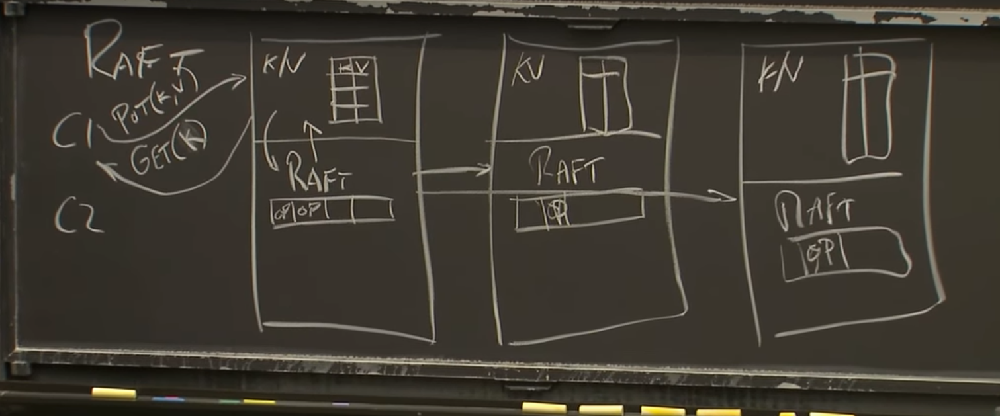

# Distributed Systems

## MIT Lectures

Feel free to click on each lecture to navigate to the related youtube video.

### [Lecture 1: Introduction](https://www.youtube.com/watch?v=cQP8WApzIQQ&list=PLrw6a1wE39_tb2fErI4-WkMbsvGQk9_UB)

**Why to use distributed architecture**

- Parallelism
- Fault Tolerance
- Security on Isolated Systems

**Basic Challenges**

- Concurrency
- Partial Failure
- Performance

**Infrustructures**

- Storage
- Communication
- Computation

**Some Implementations:**

- RPC
- Threads
- Concurrency Control

**Fault Tolerance:**

- Availability
- Recoverability
- Non-Volatile Storage
- Replication

**GFS:** Google File System which splits each file of data into 64 megabytes of chunks, and stores them on distributed systems. It reminds me of the same thing which IPFS(InterPlanetary File System) does, chunking data into separate IPFS nodes AKA distributed systems running IPFS locally.


### [Lecture 2: RPC and Threads](https://www.youtube.com/watch?v=gA4YXUJX7t8&list=PLrw6a1wE39_tb2fErI4-WkMbsvGQk9_UB&index=2)

**Threads**

> Note: Each thread has its own Stack

Threads provide us multiple utilities:

- I/O Concurrenncy
- Parallelism
- Convenience (Ease of doing periodic jobs and processes in the background)

**Thread Usage Challenges**

- Race: Changing the state of a variable which is shared between threads

> Note: Race can be overcome via Locks (Mutex in Go)

- Coordination: Threads don't know information of eachother's existence. There are several ways to fix this:

1. Channels
2. sync.Cond
3. waitGroup - Launching a known number of Goroutines and wait for them to finish

- Deadlock: The situation where all threads and processes are waiting for eachother causing no progress in the system.

**Web Crawler Section**

- If 2 or more threads are trying to achieve the same functionality inside a program, to make each thread isolated the code should have `Mutex Locks` which lock the first thread running and let it be finished and then let other threads do the same.
- `sync.WaitGroup`: When we have multiple threads, locks can handle the resource sharing and wait-groups can handle usage-time-sharing, so if we want a thread to do something before the next thread starts doinng the same, we do as below:

```Golang

// define a work-group
var wg sync.WaitGroup

// before goroutine acts
wg.Add(1)

// perform the goroutine
// ...
// Inside each goroutine
.
.
.
defer wg.Done()
.
.
.
// outside of the goroutine, we wait for the goroutines to be done
wg.Wait()

```

- `go run -race somefile.go` will run the code and examine if any race can happen on goroutines.

- We should pay attention, how many threads are we opening because it may be a lot and not memory-efficient to create unlimited threads as they consume memory per creation.

**Web Crawler with Usage of Channels and Goroutines**

- This approach doesn't need mutex locks. Instead, it requires a channel of URLS, a parent function to read from the channel and a worker function to write into the channel.

- To initiate a channel, a data should be written into it in a separate goroutine, then the channel is ready to be used.

### [Lecture 3: GFS](https://www.youtube.com/watch?v=EpIgvowZr00&list=PLrw6a1wE39_tb2fErI4-WkMbsvGQk9_UB&index=3)

**Bad Replication**

- 2 clients updating the same resource on 2 different instances(aka clusters) of a server, may cause uncertainty about the result, if bad replication occurs while creating replicas of a server.

- Master server is connected to some chunk servers, in which each master server holds 2 tables:

1. A map from `filename` to an `array of chunk handles`
2. A map from `handle` to `list of chunk server IDs`

- Reads from the tables are from memory but writes to the tables are stored in disk so the tables are both on memory and disk.

- Read from table process:

1. name, offset -> master
2. master sends chunk handle, and a list of server -> data is chached
3. client talks to one of the chunk servers to retrieve data

- Write to a table process:

1. Find up to date replicas
2. Pick Primary and the Secondary
3. Increment the version number
4. Tells Primary and the Secondary and the Version
5. Master writes version number to disk
6. Primary picks offset
7. All replicas are told to write at offset
8. If all replicas respond with "YES", then the Primaries are gonna reply "SUCESS" to the client
9. Otherwise, the Primaries are gonna reply "NO" to the client

### [Lecture 4: Primary-Backup Replication](https://www.youtube.com/watch?v=M_teob23ZzY&list=PLrw6a1wE39_tb2fErI4-WkMbsvGQk9_UB&index=4)

**Replication Fault Tolerance**

- If power goes off or network cable accidentally is cut off, replication makes sure the server is still running.

- Bugs in the code, or hardware problems cannot be handled with replication.

**Approaches to Replication**

- There are 2 approaches to consider:

1. State Transfer: Transfers primary state to the disk (mainly states which were stored in RAM)
2. Replicated State Machine (Stores the replicated server's events on disk)

**Main Bottlenecks**

- How much staate transfer should happen

> Note: It is usually the whole system's state, even if it's very big (becuase of the consistency of the data)
- How closely can Primary and Backup data be?
- Which state transfer approach to use (considering one is more robust and one is more effective)
- How to handle anomalies
- Is it convenient to stay with the current setup or create a new replica which requires costs

**Virtual Machine Fault Tolerance - VM FT**

- It consists of 2 parts:

1. Virtual Machine Monitor - VMM
2. OS Kernels
3. Software running on the OS

- As for replication we have at least 2 VMs communicating with eachother

- The virual machines for replication are usually a pair to handle `Primary` and `Backup` data.

- For replication, all the VMs are connected to eachother via LAN along with Clients and Disk Servers. The communicating packets between clients and VMs (both primary and backup) are called `Log Events` which are emitted on a `Log Channel`

- Non-deterministic Events:

1. Inputs from external sources like clients - consisting of network packets(data + interrupt)
2. Weird Instructions
3. Multicore Parallelism

- Log Entry Format:

1. Instruction number (instruction number since booting)
2. Type of instruction
3. Data

- Output Rule: The primary is not allowed to respond to the client before the backup has acknowledged primary of being done with the data.

### [Lecture 5: Go, Threads, and Raft](https://www.youtube.com/watch?v=UzzcUS2OHqo&list=PLrw6a1wE39_tb2fErI4-WkMbsvGQk9_UB&index=5)

- Shared variables need to be protected by lock mechanism or channels.

**Conditional Variable Pattern**

- When we have shared variables between threads and all threads are trying to reach a certain condition, mutating the shared variable, to check for the condition we use `cond sync.Cond` and pass the shared `mu sync.Mutex` pointer to it, and whenever the state of the shared variable is changes inside each goroutine, we will do `cond.Broadcast` to share the variable state and condition checks between all the goroutines. The waiting process to get the condition to be true, is done by `cond.Wait()` syntax.


> Note: Be sure to check the `thread.go` sample codes inside the `lecture-5` directory for this lecture.


### [Lecture 6: Fault Tolerance: Raft (1)](https://www.youtube.com/watch?v=64Zp3tzNbpE&list=PLrw6a1wE39_tb2fErI4-WkMbsvGQk9_UB&index=6)

- As told before, all the systems mentioned till now (GFS, VMFT, ...) have a mechanism in which one single server acts as the one server which decides the final decision.

- Worst thing about a single server handling everything is that server may become the single point of failure which is called the `Split Brain`.

- One way to deal with the split brain is build an actual network that cannot fail, even if it's an expensive approach to take. Another approach is to use human reviewer over the network but that also may lead to failure due to the human incapability of handling fast tasks maybe too many tasks at the same time.

- Splitting the network in half to make client-server talk to each other is called partitioning.

- The idea to handle automated failure recovery for split brain case, is called `Majority Vote` which means more than half of the servers should vote positive that the network is up. (Something like what bitcoin does)

- If you have 2F+1 servers you can withstand F failures, so if you have 3 servers that means you can withstand 1 server failure and still make sure your network won't break.

***Software Overview of a Single Raft Replica:**

- Layers are as below:

1. A key/value server with a table of keys and values from other servers

2. Raft Layer containing logs of operation and chitchat between itself and the key/value server layer.

- What happens inside of a Raft:

1. Client sends request to the server

2. K/V layer (application layer) sends the request log to the Raft layer

3. Rafts chit-chat with eachother which each one is located inside different replicas

4. When the data is stored inside each replica and their logs, the primary raft sends a notification up to the application layer letting it know the data is persisted completely

5. When the notification is sent on the leader server, all replicas send raft data to the k-v table to be stored.




- How does a leader get selected in the first place:

1. The system has an election timer

2. Whenever the timer exceeds its limit and the leader is expired, the system decides to do election to find a new leader in the servers


- Example:

|          | Log Data | Term # |
| -------- | -------- | ------ |
| Server 1 | 3        |        |
| Server 2 | 3        | 3      |
| Server 3 | 3        | 3      |

> This may happen if server 2 or 3 crashed on sending data to server 1

