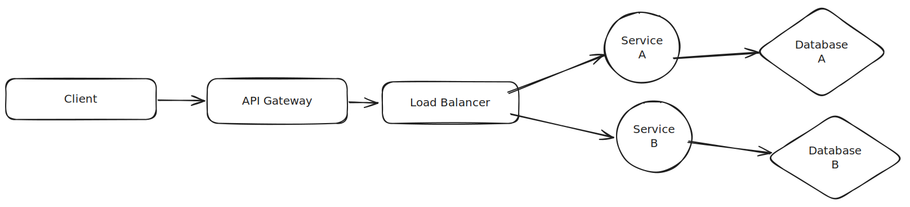
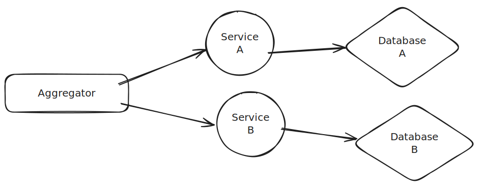

# Microservices

Microservice design is an architectural style that structures an application as a collection of small autonomous services, modelled around a business domain. In a Microservice-Architecture approach, each service is self-contained and implements a single business capability.

## Links

- [Microservices Design Patterns](https://www.youtube.com/watch?v=xuH81XGWeGQ)
- [Microservices Design Patterns: Mastering Design Patterns & Design Principles 🔥 🔥 🔥](https://www.youtube.com/watch?v=9QTsXLB6Al8)

## Design Patterns

These are the design patterns around microservice architecture:

### Decomposition Patters

- Decompose by Business Capability
- Decompose by Subdomain
- Strangler Pattern
- Bulkhead Pattern
- Sidecar Pattern

### Intergration Patterns

- API Gateway Pattern

- Aggregator Pattern

> Note:
This pattern is used when there is a need to process a request which requires more than one service to respond

- Proxy Pattern
- Gateway Routing Pattern
- Chained Microservice Pattern

> Note:
There are chain of services which process eachother's output before responding to the client. Because the output result is needed by the next service to use, all the processes are synchronized so it's recommended not use a long chain of services, unless the client response time may increase significantly.

- Branch Pattern

> Note:
Branching Services and then processing requests and responses from those branch of services. It's a way to categorize the microservices and give more abstract meaning to the functionality of each category.

- Client-side UI Composition Pattern

### Database Patterns

- Database Per Service Pattern
- Shared Database Per Service Pattern
- CQRS Pattern
- Event Sourcing Pattern

> Note:
Application is divided into 2 parts: **Command** & **Query**
Whenever a client tries to read from one service/resource or more, they send a `query` request to the application, and whenever client requests a change and alter in the application state or some resource, they send a `command` request.

- Saga Pattern

### Observability Patterns

- Log Aggregation Pattern
- Performance Metrics Pattern
- Distributed Tracing Pattern
- Health Check Pattern

### Cross-Cutting Concerns Patterns

- External Configuration Pattern
- Service Discovery Pattern
- Circuit Breaker Pattern

> Note:
The approach to stop the process of request and response if a service is down. It breaks the flow of req/res processing if a service is down or fails to respond after a certain threshold passed.

- Blue-Green Deployment Pattern
- Canary Deployment Pattern

## Design Principles

- DDD or the Domain Driven Design
- Built around business capabilities
- Single Responsibility
- High cohesion and low coupling
- Decentralized data
- Failure Isolation
- Fault Tolerant
- Hexagonal Architecture

- Continuous Delivery with Devops
- Continuous Monitoring and Distributed Tracing